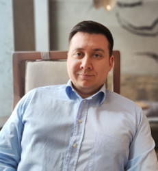

# Резюме Троицкий Илья - Data Scince специалист

## Желаемая должность и оплата

Data Scince специалист, 80000 руб.

## Контакты

- Телефон: +79617693325
- Телеграм: [ivtroitskiy](https://t.me/ivtroitskiy)
- Почта: ilya@troitskiy.name

## Опыт работы

### Data Science bootcamp — Яндекс Практикум (обучение)

Апрель 2023 - Октябрь 2023

#### Достижения

1. Обработка и анализ большого массива данных (SQL, pandas, seaborn). Применил знания на практике: делал подробный анализ фоновых заданий 1с, дающих нагрузку на сервер СУБД.
2. Оценка стоимости квартиры (Линейная регрессия, кодирование данных, , баланс классов, кодирование категориальных фич)
3. Предсказание процентного содержания металла в породе по параметам тех процесса (CatBoost, нормализация данных, исключение лишних фич)
4. Определение токсичности текста (TF-IDF, BART)
5. Определение фрукта на изображении (модификация датасета, tensorflow, pytorch)

ТУТ ДОЛЖНЫ БЫТЬ ССЫЛКИ НА ПРОЕКТЫ

### Сима-ленд —  teamlead 

2020 - настоящее время

#### Достижения

1. Внедрил управление задачами в Jira/Gitlab. Появилась прозрачность работы группы для заказчика.
2. Автоматизировал отчетность сотрудников  и уведомления об изменении статусов задач (python скрипт и база на 1с для формирования недельных и месячных отчетов) - заказчик и разработчики меньше времени тратят на бюрократию и хождения по жирам
3. Разработал аналитические отчеты по задачам - заказчик стал видеть, куда уходит время программистов и правильно расставлять приоритеты.
4. Разработал интеграцию 1с с elastic search, который стал стандартом для  логирования в подразделении 1с. Через эластик и графану реализовали мониторинг работы системы и аналитические отчеты. 
5. Работал с linux, docker, ClickHouse, redash (дашборды), rabbitMQ

#### Обязанности

- Управление разработкой: Распределение и контроль задач, архитектура системы
- Работа с подчиненными: Мотивация, развитие, решение конфликтных ситуаций
- Работа с заказчиком: Приоритезация задач, отчетность, планирование развития автоматизации
- Работа с руководством: Отчетность, ресурсы для команды.

## Образование

УрГУ, мат-мех, компьютерные науки (2002 - 2007, неокончил)

## Навыки

Базовые: linux, 
Dev: python, docker
DB: SQL (Postrge, MSSQL). no-SQL (CH, elastic search)
DA: Pandas, NumPy, PySpark, Seaborn
ML: Scikit-learn, CatBoost, TensorFlow, PyTorch, Keras, OpenCV

## Обо мне
Не люблю стоять на месте и регулярно учусь новому. Сейчас зудит и свербит в одном месте от желания стать спициалистом в МЛ и приносить прибыль компании с помощью этой технологии. Отлично развиты софтскилы.  

Женат, трое детей, есть чуствор юмора, психологический возраст - 29 лет :)